# Discussment-example
## Getting started
 - create an empty MySQL database with the name `discussment`

 - run command `mvn tomcat7:run` in the dicussment-example folder where __pom.xml__ is located
   !must be compiled under java8, in 9 you will get errors!

 - this command runs compile source codes and creates a __war__ file that deploy in Tomcat. The example runs on web address: `localhost:8080/discussment-example/`

 - if you have done everything right, you'll see an empty dashboard, so it's time to register first user
   
   
   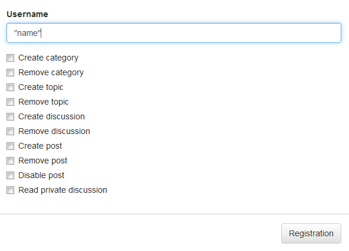 
   
   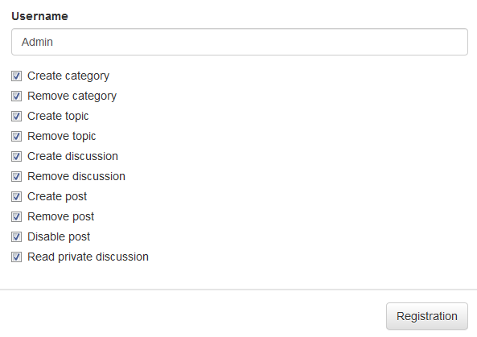
   
   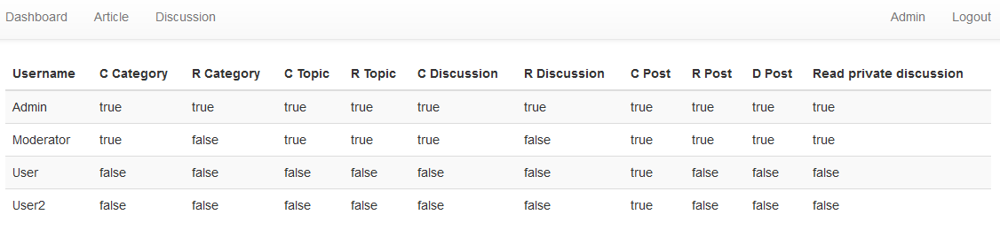

## Discussion
 - the discussion is empty, for now :)
 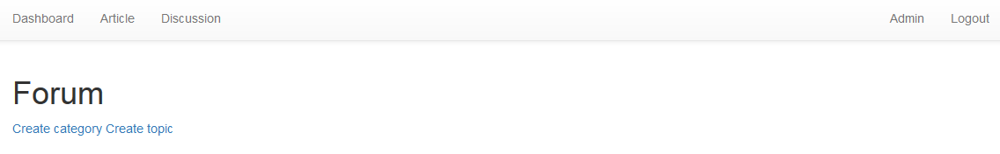

### Forum controls
   - Creating a category
    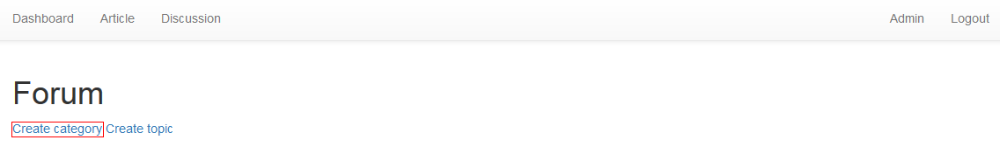
     - creates a new category
       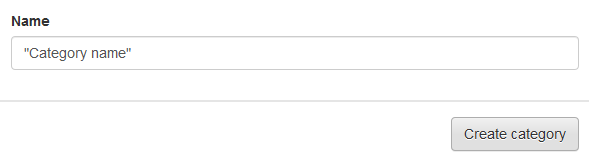
       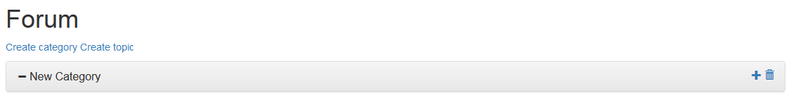
   - Creating a topic
    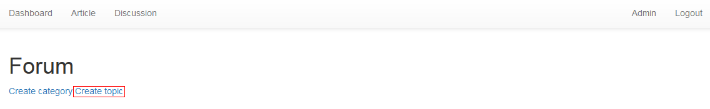
     - creates a new topic that isn't under any category
       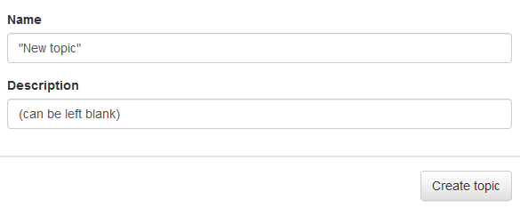
       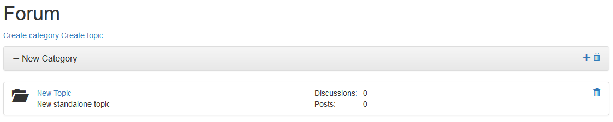
   - Creating topic under a category
    
     - creates a new topic under that category
       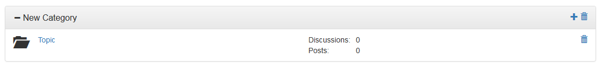
   - Deleting a category
    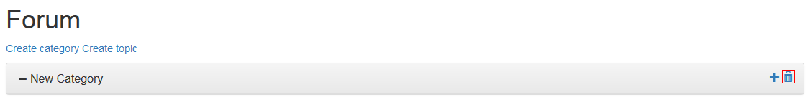
     - deletes a category and all it's topics, discussions and posts
   - Hiding topics in a category
    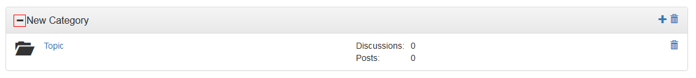
     - collapses/expands topics in the category 
      
  

### Discussion management
    
   - Creating a new discussion 
    
    
     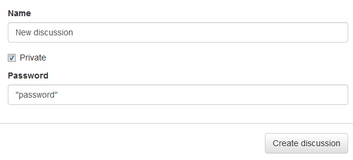 
     - creates a new discussion in the topic
     - checking private creates password protected discussion
       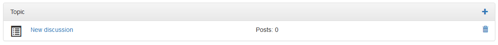
   - Making a new post 
    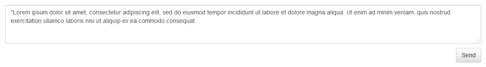
     - creates a new post in the discussion
       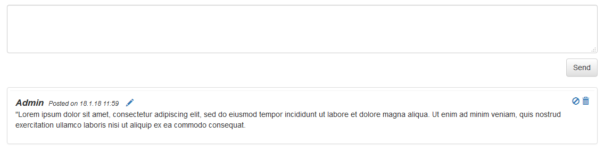
   - Making a reply to a post 
    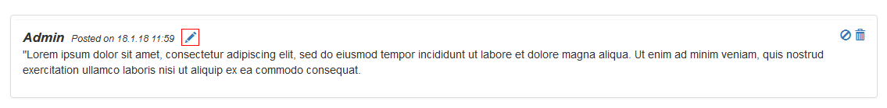
     
      
     - makes a reply to this post
       
   - Disabling a post
    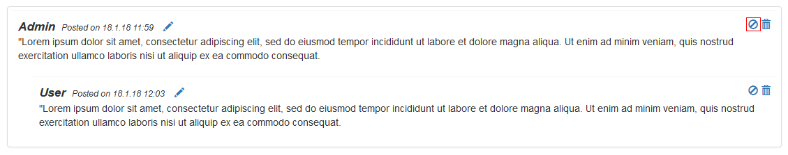
     - hides the post without deleting it 
   - Restoring a post 
    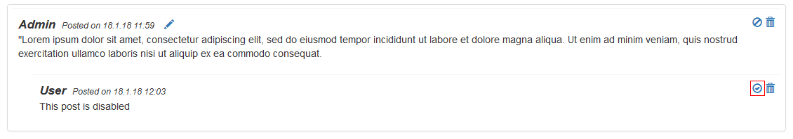
     - restores the post
       
   - Deleting a post
    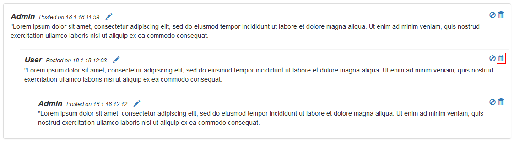
     - deletes the post and all it's replies
       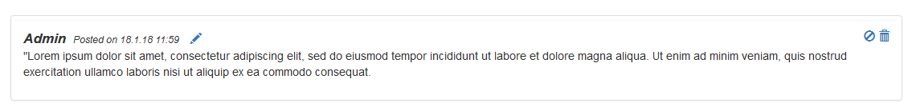

