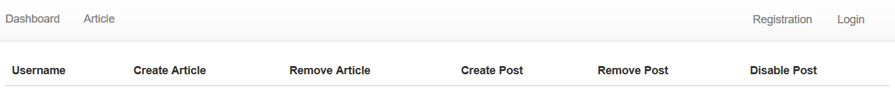
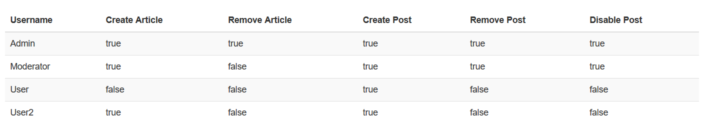
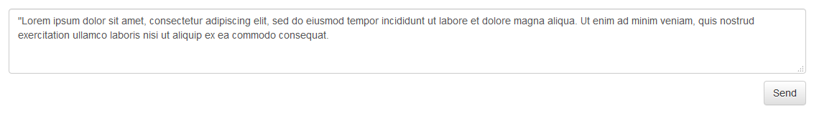
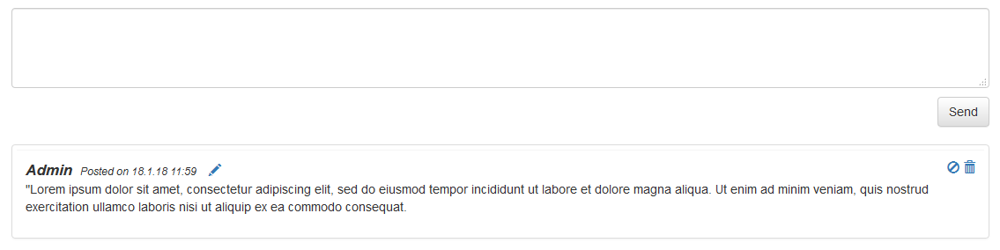

# Articles Example

**Update 2023:** This example doesn't work.

## Getting started
 - create an empty MySQL database with the name `discussment`

 - run command `mvn tomcat7:run` in the __article__ folder where __pom.xml__ is located
   !must be compiled under java8, in 9 you will get errors!

 - this command runs compile source codes and creates a __war__ file that deploy in Tomcat. The example runs on web address: `localhost:8080/discussment-article/`

 - if you have done everything right, you'll see an empty dashboard, so it's time to register first user
    
       
     
       
    
       
    
    
## Articles
 - !articles use the same access rights as categories!
 - there aren't any articles so let's make some
### Article management
 - Creating an article
   
   - Creates a new article
      
     
 - Deleting an article
   
   - Deletes an article and its discussion
     
 - Opening an article
   - After opening of the article you will see it's text and discussion to which you can post
     
 - Making a post 
   
   - Adds a new post under the article
     
 - Making a reply 
   
   - Adds a new reply to the discussion
     
     
 - Disabling a post 
   
   - Disables a post without deleting it, can be later restored
     
 - Deleting a post
  
   - Deletes a post and all its replies 
     